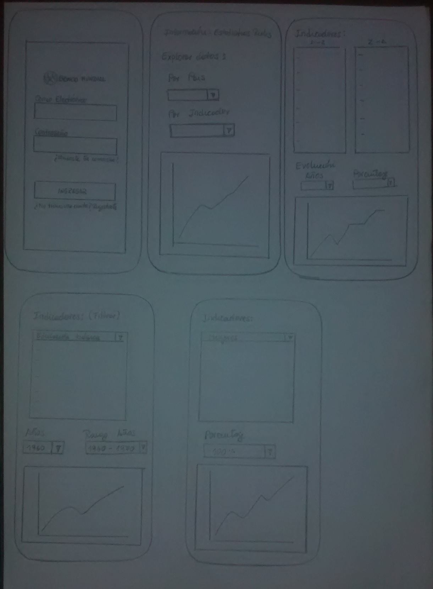
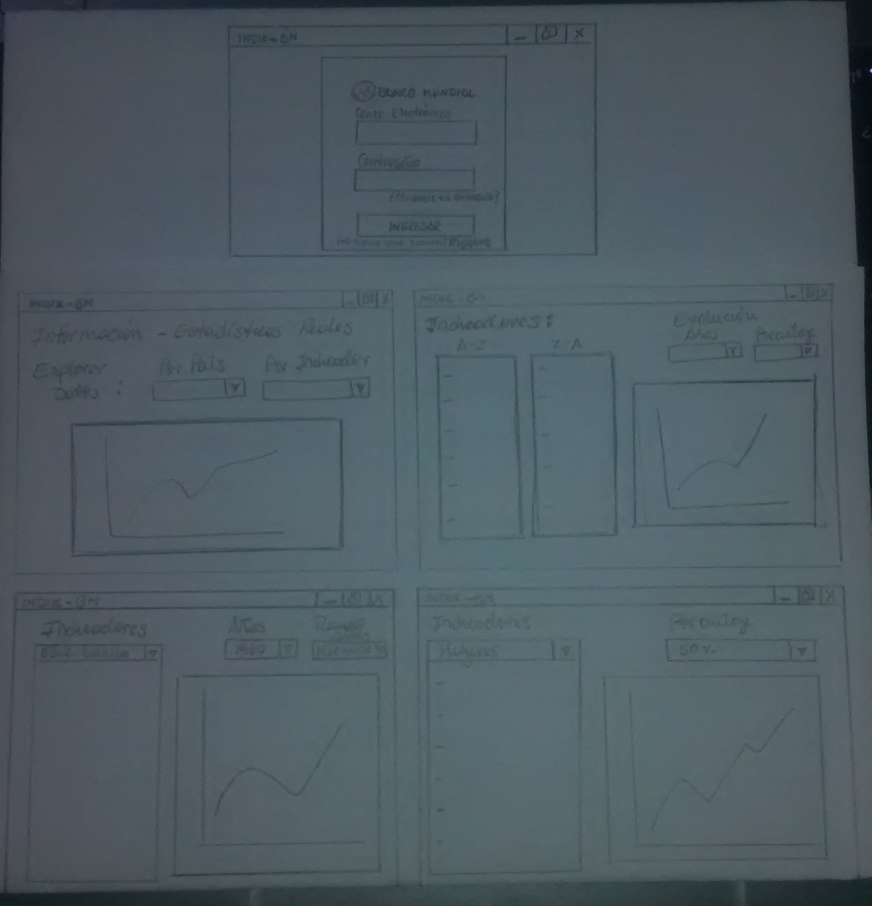

# INDIK-BM

## Índice

- [Índice](#índice)
- [Resumen de Proyecto](#preámbulo)
- [Imagen final de Proyecto](#objetivos-de-aprendizaje)
- [Investigación UX](#consideraciones-generales)

***

## Resumen de Proyecto

Esta Web permitirá brindar a los usuarios - inversionistas los indicadores ( demográficos,
económicos y comerciales) que le permitirá una mejor visión en la toma de decisiones.

## Imagen final del Proyecto

## Investigación UX

  - Los Usuarios son los clientes o tambien denominados inversionistas, en quienes recae la toma decisiones; que se convierte en el objetivo principal del presente producto denominado "INDIK-BM" que finalmente contribuirá  con información de variables y estadisticas reales, para futuras inversiones.

  - "INDIK-BM", es creado con la finalidad de brindarle al cliente información  que le permitirá tener una visión no solo de Perú sino tambien de Brasil, Mexico y Chile; y el comportamiento real de dichas regiones considerdas dentro de cada variable materia de estudio.

  - Para poder interactuar con INDIK-BM, al iniciar sesión deberá considerar como Usuario y Contraseña LABORATORIA.

    ## Prototipo de Baja Fidelidad en papel:
  
  - Mobile 

  

  - Desktop

  (imagenes/desktop1.jpg)

  - Agregar un resumen del feedback recibido indicando las mejoras a realizar.

  - Imagen y link del prototipo de alta fidelidad final (mobile y desktop) en 
  Figma.

