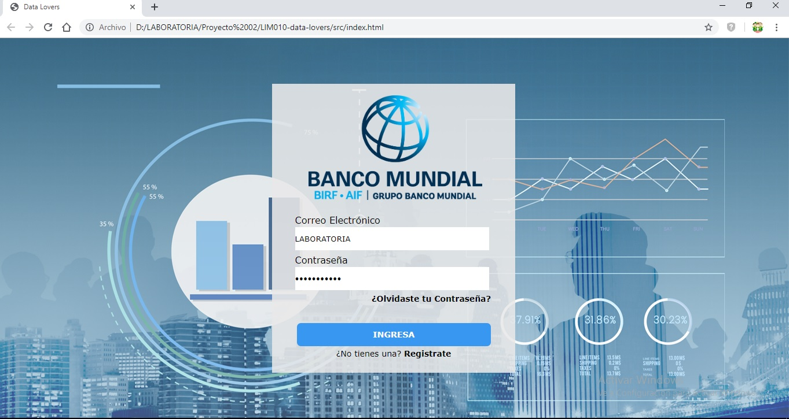
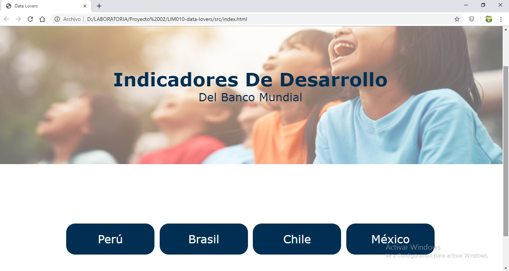
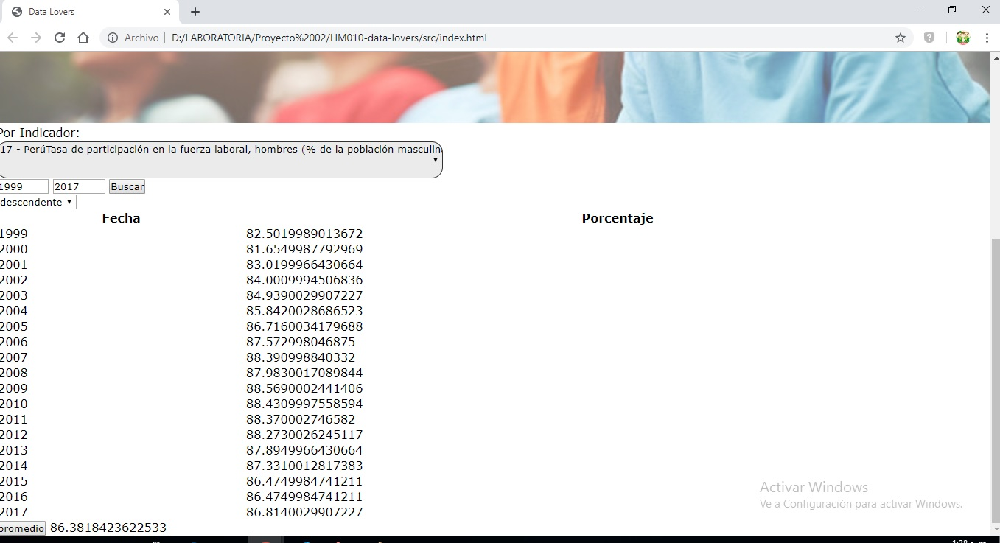
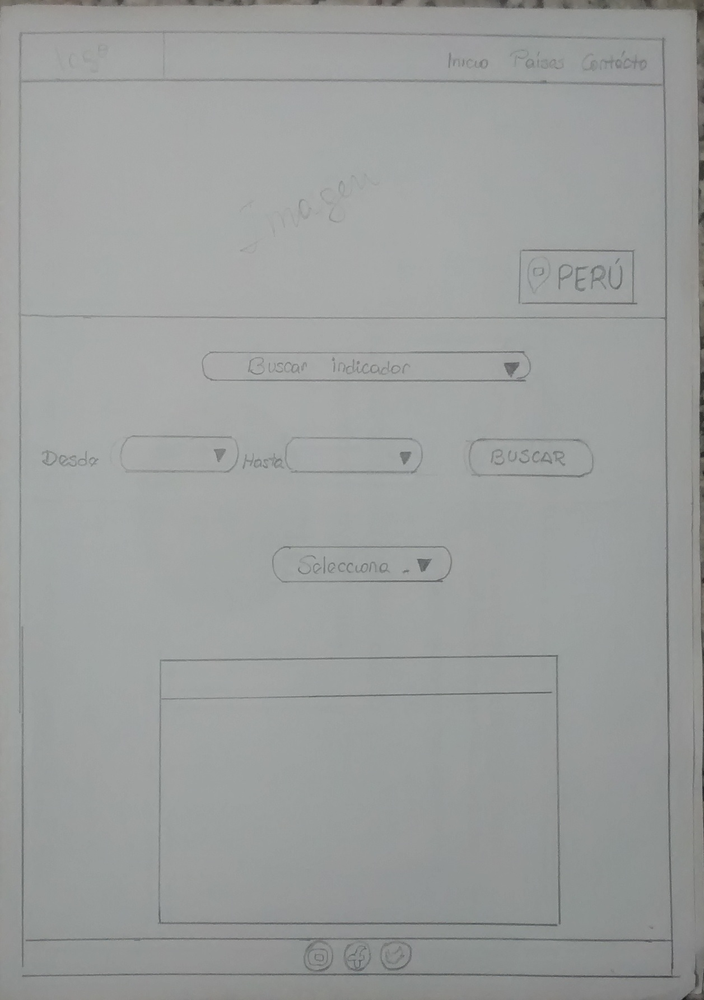

# INDIK-BM

## Índice

- [Índice](#índice)
- [Resumen de Proyecto](#preámbulo)
- [Imagen final de Proyecto](#objetivos-de-aprendizaje)
- [Investigación UX](#consideraciones-generales)

***

## Resumen de Proyecto

Esta Web permitirá brindar a los usuarios - inversionistas los indicadores ( demográficos,
económicos y comerciales) que le permitirá una mejor visión en la toma de decisiones.

## Imagen final del Proyecto

  - Login: 

    

  - Seleccionar País:

    

  - Seleccionar Indicador, Rango de Fechas, ordenar y hallar promedio:

    

## Investigación UX

  - Los Usuarios son los clientes o tambien denominados inversionistas, en quienes recae la toma decisiones; que se convierte en el objetivo principal del presente producto denominado "INDIK-BM" que finalmente contribuirá  con información de variables y estadisticas reales, para futuras inversiones.

  - "INDIK-BM", es creado con la finalidad de brindarle al cliente información  que le permitirá tener una visión no solo de Perú sino tambien de Brasil, Mexico y Chile; y el comportamiento real de dichas regiones considerdas dentro de cada variable materia de estudio.

  - Para poder interactuar con INDIK-BM, al iniciar sesión deberá considerar como Usuario y Contraseña LABORATORIA.

    ## Prototipo de Baja Fidelidad en papel:
  
  - Mobile 

  

  - Desktop

  
  

  - Agregar un resumen del feedback recibido indicando las mejoras a realizar.

      *) Jose Roldan (26 años - Consultor en un Banco): Las tres ventanas, me gustan pero, solo son indicadores de Desarrollo o hay mas tipos.

      *) Ariana Pacheco(22 años - Estudiante Laboratoria): La primera pantalla sirve para loguearme lo unico que no me parece es que deban ir los link's para contacto inicio y paises, la segunda me queda claro que debo ingresar un País para ver su data y la tercera me parece muy linda y amigable.

      *) Maritza Benites (45 años - Empresaria): Al visualizar las tres paginas observo una armonia en colores y funcionalidad, me queda claro para que es cada pantalla, es amigable e intuitiva.

  - Imagen y link del prototipo de alta fidelidad final (mobile y desktop):
  
  - [Figma](https://www.figma.com/file/YhFH7ljNR8c0EmsqcoNiFc/Banco-Mundial?node-id=0%3A1 )

