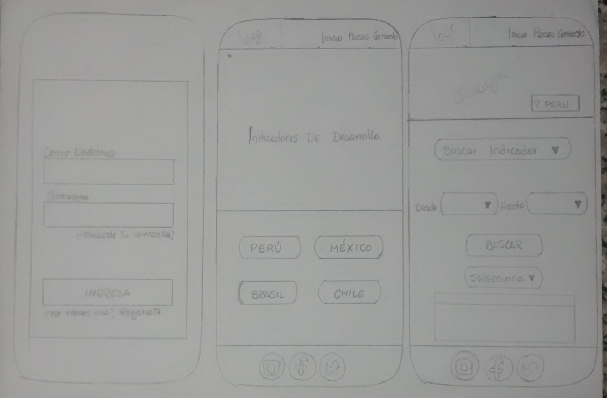

# INDIK-BM

## Índice

- [Índice](#índice)
- [Resumen de Proyecto](#preámbulo)
- [Imagen final de Proyecto](#objetivos-de-aprendizaje)
- [Investigación UX](#consideraciones-generales)

***

## Resumen de Proyecto

Esta Web permitirá brindar a los clientes - inversionistas los indicadores ( demograficos,
económicos y comerciales) que le permitirá una mejor visión en la toma de decisiones.

## Imagen final del Proyecto

## Investigación UX

  - Los Usuarios son los clientes o tambien denominados inversionistas, en quienes recae la toma decisiones; que se convierte en el objetivo principal del presente producto denominado "INDIK-BM" que finalmente contribuirá  con información de variables y estadisticas reales, para futuras inversiones.

  - "INDIK-BM", es creado con la finalidad de brindarle al cliente información  que le permitirá tener una visión no solo de Perú sino tambien de Brasil, Mexico y Chile; y el comportamiento real de dichas regiones considerdas dentro de cada variable materia de estudio.

  - Para poder interactuar con INDIK-BM, al iniciar sesión deberá considerar como Usuario y Contraseña LABORATORIA.

    ## Prototipo de Baja Fidelidad en papel:
  
  - Mobile 

  

  - Desktop

  

  - Agregar un resumen del feedback recibido indicando las mejoras a realizar.
  Agregar resumen del Feedback recibido:

  Jose Roldan (26 años - Consultor Banco): Las tres ventanas me gustan, solo son indicadores de desarrollo o hay más tipos.

  Ariana Pacheco (22 años - Estudiante Laboratoria): La primera pantalla sirve para loguearme lo que no me parece es que debían ir los link’s para contacto inicio, países, la segunda me queda claro que debo seleccionar un País para ver su data, la tercera me queda muy clara y amigable.

  Maritza Benites (46 años - Empresaria): Al observar las tres páginas veo armonía de colores y funcionalidad, me queda claro para qué es cada pantalla es intuitiva y amigable.

  - Imagen y link del prototipo de alta fidelidad final (mobile y desktop) en 
  Figma.

https://www.figma.com/file/G6sP4nbZ28cPrH3fSEGHG38x/Untitled?node-id=0%3A1

Vista escritorio

Vista en mobile
